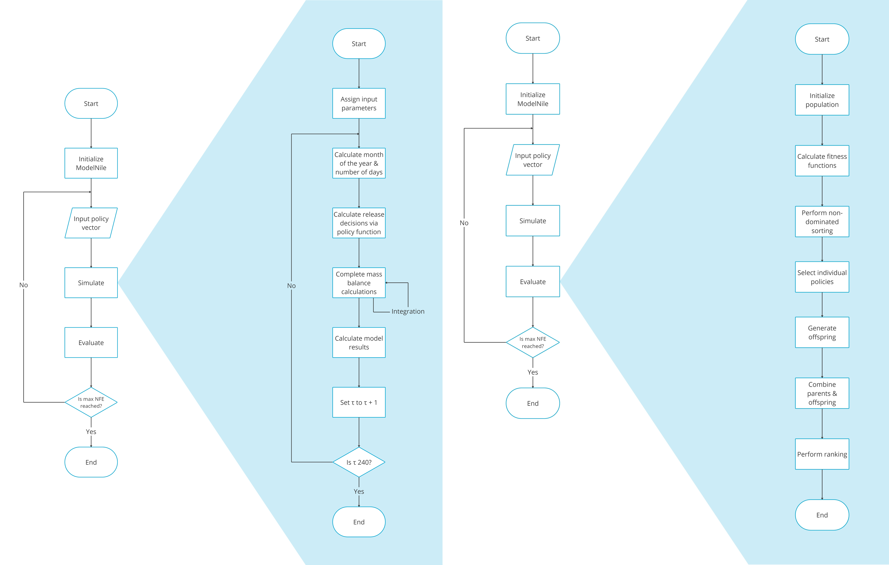

# Exploring Trade-offs in Reservoir Operations through Many Objective Optimisation

## Case of Nile River Basin

This repository includes the code associated with the [MSc. thesis project](https://resolver.tudelft.nl/uuid:d881ffe2-a11d-463c-91b5-ff17c5aadc27) of Meron Znabei as the partial requirement for the Engineering and Policy Analysis programme of TU Delft. It concerns the model of the Eastern Nile System built from the perspective of the evolutionary multi-objective direct policy search (EMODPS) framework. 

 The model includes 4 reservoirs -- namely the Grand Ethiopian Renaissance Dam (GERD), Roseires, Sennar, and High Aswan Dam (HAD) as in figure 1.

 
<figcaption align = "center"><b>Figure 1 - Topological overview of the modelled system</b></figcaption>

 Policies which govern release decisions for these reservoirs are optimised with respect to six country specific objectives and three aggregated objectives based on different Distributive Justice Principles, all presented in figure 2:


<figcaption align = "center"><b>Figure 2 - Objectives of the optimisation problem</b></figcaption>

## Understanding the inner workings of the Model

Following the EMODPS methodology, release decisions are made by using a closed loop control policy that returns the decisions conditioned on dynamic inputs. Candidate control policies are initialised as a collection of radial basis functions (RBF). These are used for model simulation. The aim of the optimisation is to find the parameter values of the release policies for near Pareto-optimal solutions. Created policies are evaluated using the objectives from above for optimisation. The model flowchart in figure 3 can be used to understand these steps and the overall model logic. Users can resimulate optimised policies to obtain the performance metrics and physical quantities of the system with a particular policy. Various uncertainty analyses described in the thesis report can also be found in the output analysis section.


<figcaption align = "center"><b>Figure 3 -  The model flowchart with sub-flowcharts providing a zoom in on the simulation and evaluation steps.
</b></figcaption>


<!-- <!-- ## Repository Structure -->

```
master-thesis-project
├─ .git
│  ├─ COMMIT_EDITMSG
│  ├─ config
│  ├─ description
│  ├─ FETCH_HEAD
│  ├─ HEAD
│  ├─ hooks
│  │  ├─ applypatch-msg.sample
│  │  ├─ commit-msg.sample
│  │  ├─ fsmonitor-watchman.sample
│  │  ├─ post-update.sample
│  │  ├─ pre-applypatch.sample
│  │  ├─ pre-commit.sample
│  │  ├─ pre-merge-commit.sample
│  │  ├─ pre-push.sample
│  │  ├─ pre-rebase.sample
│  │  ├─ pre-receive.sample
│  │  ├─ prepare-commit-msg.sample
│  │  ├─ push-to-checkout.sample
│  │  └─ update.sample
│  ├─ index
│  ├─ info
│  │  └─ exclude
│  ├─ logs
│  │  ├─ HEAD
│  │  └─ refs
│  │     ├─ heads
│  │     │  ├─ adaptiveSWF
│  │     │  ├─ demand
│  │     │  ├─ dev
│  │     │  ├─ main
│  │     │  ├─ relative-to-demand
│  │     │  ├─ seeds
│  │     │  └─ testing
│  │     ├─ remotes
│  │     │  ├─ origin
│  │     │  │  ├─ dev
│  │     │  │  ├─ exp
│  │     │  │  │  └─ nfe-epsilon
│  │     │  │  ├─ feature
│  │     │  │  │  └─ principles
│  │     │  │  ├─ HEAD
│  │     │  │  ├─ main
│  │     │  │  ├─ run-experiments
│  │     │  │  └─ testing
│  │     │  └─ upstream
│  │     │     ├─ HEAD
│  │     │     └─ main
│  │     └─ stash
│  ├─ ORIG_HEAD
│  ├─ packed-refs
│  └─ refs
│     ├─ heads
│     │  ├─ adaptiveSWF
│     │  ├─ demand
│     │  ├─ dev
│     │  ├─ main
│     │  ├─ relative-to-demand
│     │  ├─ seeds
│     │  └─ testing
│     ├─ remotes
│     │  ├─ origin
│     │  │  ├─ dev
│     │  │  ├─ exp
│     │  │  │  └─ nfe-epsilon
│     │  │  ├─ feature
│     │  │  │  └─ principles
│     │  │  ├─ HEAD
│     │  │  ├─ main
│     │  │  ├─ run-experiments
│     │  │  └─ testing
│     │  └─ upstream
│     │     ├─ HEAD
│     │     └─ main
│     ├─ stash
│     └─ tags
├─ .gitattributes
├─ .gitignore
├─ .vscode
│  ├─ launch.json
│  └─ settings.json
├─ convergence.ipynb
├─ data
│  ├─ evap_GERD.txt
│  ├─ evap_HAD.txt
│  ├─ evap_Roseires.txt
│  ├─ evap_Sennar.txt
│  ├─ InflowAtbara.txt
│  ├─ InflowBlueNile.txt
│  ├─ InflowDinder.txt
│  ├─ InflowGERDToRoseires.txt
│  ├─ InflowRahad.txt
│  ├─ InflowRoseiresToAbuNaama.txt
│  ├─ InflowSukiToSennar.txt
│  ├─ InflowWhiteNile.txt
│  ├─ IrrDemandDSSennar.txt
│  ├─ IrrDemandEgypt.txt
│  ├─ IrrDemandGezira.txt
│  ├─ IrrDemandHassanab.txt
│  ├─ IrrDemandTaminiat.txt
│  ├─ IrrDemandUSSennar.txt
│  ├─ lsto_rel_GERD.txt
│  ├─ lsto_rel_HAD.txt
│  ├─ lsto_rel_Roseires.txt
│  ├─ lsto_rel_Sennar.txt
│  ├─ lsur_rel_GERD.txt
│  ├─ lsur_rel_HAD.txt
│  ├─ lsur_rel_Roseires.txt
│  ├─ lsur_rel_Sennar.txt
│  ├─ min_max_release_GERD.txt
│  ├─ min_max_release_HAD.txt
│  ├─ min_max_release_Roseires.txt
│  ├─ min_max_release_Sennar.txt
│  ├─ stosur_rel_GERD.txt
│  ├─ stosur_rel_HAD.txt
│  ├─ stosur_rel_Roseires.txt
│  ├─ stosur_rel_Sennar.txt
│  ├─ sto_min_max_release_GERD.txt
│  ├─ sto_min_max_release_HAD.txt
│  ├─ sto_min_max_release_Roseires.txt
│  └─ sto_min_max_release_Sennar.txt
├─ experimentation
│  ├─ baseline_optimization.py
│  ├─ data_generation.py
│  ├─ Profiling.ipynb
│  ├─ resimulation_under_scenarios.py
│  ├─ scenario_discovery_runs.py
│  ├─ slurm-725975.out
│  ├─ slurm-739658.out
│  ├─ slurm-741110.out
│  ├─ slurm-749380.out
│  ├─ slurm-801906.out
│  ├─ __init__.py
│  └─ __pycache__
├─ main.py
├─ main_output_analysis.py
├─ model
│  ├─ model_classes.py
│  ├─ model_nile.py
│  ├─ model_nile_scenario.py
│  ├─ smash.py
│  ├─ __init__.py
│  └─ __pycache__
├─ nile_EMODPS_framework
│  ├─ experimentation
│  │  └─ __pycache__
│  └─ plots
│     └─ baseline_optimization
│        ├─ Egypt
│        │  └─ received_vs_demand_Compromise
│        ├─ GERD
│        │  ├─ condensed_level_Compromise
│        │  ├─ level_with_limits_Compromise
│        │  └─ release_vs_inflow_Compromise
│        ├─ Gezira
│        │  └─ received_vs_demand_Compromise
│        └─ HAD
│           ├─ condensed_level_Compromise
│           ├─ level_with_limits_Compromise
│           └─ release_vs_inflow_Compromise
├─ outputs
│  ├─ nfe50000_gini_01_demand
│  │  ├─ archive_logs
│  │  │  ├─ 0.tar.gz
│  │  │  ├─ 1.tar.gz
│  │  │  ├─ 2.tar.gz
│  │  │  ├─ 3.tar.gz
│  │  │  └─ 4.tar.gz
│  │  ├─ baseline_convergence_nfe50000_gini_01_demand_s0.csv
│  │  ├─ baseline_convergence_nfe50000_gini_01_demand_s1.csv
│  │  ├─ baseline_convergence_nfe50000_gini_01_demand_s2.csv
│  │  ├─ baseline_convergence_nfe50000_gini_01_demand_s3.csv
│  │  ├─ baseline_convergence_nfe50000_gini_01_demand_s4.csv
│  │  ├─ baseline_results_nfe50000_gini_01_demand.csv
│  │  ├─ baseline_results_nfe50000_gini_01_demand_s0.csv
│  │  ├─ baseline_results_nfe50000_gini_01_demand_s1.csv
│  │  ├─ baseline_results_nfe50000_gini_01_demand_s2.csv
│  │  ├─ baseline_results_nfe50000_gini_01_demand_s3.csv
│  │  ├─ baseline_results_nfe50000_gini_01_demand_s4.csv
│  │  ├─ baseline_results_nfe50000_None_001_demand.csv
│  │  ├─ baseline_results_nfe50000_pwf_100_demand.csv
│  │  ├─ baseline_results_nfe50000_uwf_001_demand.csv
│  │  └─ time_counter_gini_01_demand.txt
│  ├─ nfe50000_None_001_demand
│  │  ├─ archive_logs
│  │  │  ├─ 0.tar.gz
│  │  │  ├─ 1.tar.gz
│  │  │  ├─ 2.tar.gz
│  │  │  ├─ 3.tar.gz
│  │  │  ├─ 4.tar.gz
│  │  │  └─ archives.tar.gz
│  │  ├─ baseline_convergence_nfe50000_None_001_demand.csv
│  │  ├─ baseline_convergence_nfe50000_None_001_demand_s0.csv
│  │  ├─ baseline_convergence_nfe50000_None_001_demand_s1.csv
│  │  ├─ baseline_convergence_nfe50000_None_001_demand_s2.csv
│  │  ├─ baseline_convergence_nfe50000_None_001_demand_s3.csv
│  │  ├─ baseline_convergence_nfe50000_None_001_demand_s4.csv
│  │  ├─ baseline_results_nfe50000_None_001_demand.csv
│  │  ├─ baseline_results_nfe50000_None_001_demand_s0.csv
│  │  ├─ baseline_results_nfe50000_None_001_demand_s1.csv
│  │  ├─ baseline_results_nfe50000_None_001_demand_s2.csv
│  │  ├─ baseline_results_nfe50000_None_001_demand_s3.csv
│  │  ├─ baseline_results_nfe50000_None_001_demand_s4.csv
│  │  ├─ convergence_results_seed0.csv
│  │  ├─ convergence_results_seed1.csv
│  │  ├─ convergence_results_seed2.csv
│  │  ├─ convergence_results_seed3.csv
│  │  ├─ convergence_results_seed4.csv
│  │  └─ time_counter_None_001_demand.txt
│  ├─ nfe50000_pwf_100_demand
│  │  ├─ archive_logs
│  │  │  ├─ 0.tar.gz
│  │  │  ├─ 1.tar.gz
│  │  │  ├─ 2.tar.gz
│  │  │  ├─ 3.tar.gz
│  │  │  └─ 4.tar.gz
│  │  ├─ baseline_convergence_nfe50000_pwf_100_demand_s0.csv
│  │  ├─ baseline_convergence_nfe50000_pwf_100_demand_s1.csv
│  │  ├─ baseline_convergence_nfe50000_pwf_100_demand_s2.csv
│  │  ├─ baseline_convergence_nfe50000_pwf_100_demand_s3.csv
│  │  ├─ baseline_convergence_nfe50000_pwf_100_demand_s4.csv
│  │  ├─ baseline_results_nfe50000_pwf_100_demand.csv
│  │  ├─ baseline_results_nfe50000_pwf_100_demand_s0.csv
│  │  ├─ baseline_results_nfe50000_pwf_100_demand_s1.csv
│  │  ├─ baseline_results_nfe50000_pwf_100_demand_s2.csv
│  │  ├─ baseline_results_nfe50000_pwf_100_demand_s3.csv
│  │  ├─ baseline_results_nfe50000_pwf_100_demand_s4.csv
│  │  └─ time_counter_pwf_100_demand.txt
│  └─ nfe50000_uwf_001_demand
│     ├─ archive_logs
│     │  ├─ 0.tar.gz
│     │  ├─ 1.tar.gz
│     │  ├─ 2.tar.gz
│     │  ├─ 3.tar.gz
│     │  └─ 4.tar.gz
│     ├─ baseline_convergence_nfe50000_uwf_001_demand_s0.csv
│     ├─ baseline_convergence_nfe50000_uwf_001_demand_s1.csv
│     ├─ baseline_convergence_nfe50000_uwf_001_demand_s2.csv
│     ├─ baseline_convergence_nfe50000_uwf_001_demand_s3.csv
│     ├─ baseline_convergence_nfe50000_uwf_001_demand_s4.csv
│     ├─ baseline_results_nfe50000_gini_01_demand.csv
│     ├─ baseline_results_nfe50000_pwf_100_demand.csv
│     ├─ baseline_results_nfe50000_uwf_001_demand.csv
│     ├─ baseline_results_nfe50000_uwf_001_demand_s0.csv
│     ├─ baseline_results_nfe50000_uwf_001_demand_s1.csv
│     ├─ baseline_results_nfe50000_uwf_001_demand_s2.csv
│     ├─ baseline_results_nfe50000_uwf_001_demand_s3.csv
│     ├─ baseline_results_nfe50000_uwf_001_demand_s4.csv
│     └─ time_counter_uwf_001_demand.txt
├─ output_analysis
│  ├─ convergence.py
│  ├─ EDA.ipynb
│  ├─ Epsilons.ipynb
│  ├─ Minion Pro Regular.ttf
│  ├─ output_analysis.ipynb
│  ├─ parallel_plots.svg
│  ├─ Plots
│  │  ├─ 10p_Egalitarian
│  │  ├─ 10p_Egalitarian.png
│  │  ├─ 10p_Prioritarian
│  │  ├─ 10p_Prioritarian.png
│  │  ├─ 10p_Reference
│  │  ├─ 10p_Reference.png
│  │  ├─ 10p_Utilitarian
│  │  ├─ 10p_Utilitarian.png
│  │  ├─ Egalitarian.png
│  │  ├─ PC_Egalitarian.png
│  │  ├─ PC_egalitarian_brushed
│  │  ├─ PC_egalitarian_brushed.png
│  │  ├─ PC_Prioritarian.png
│  │  ├─ PC_Reference.png
│  │  ├─ PC_Reference_10p.png
│  │  ├─ PC_Reference_10p_Egalitarian.png
│  │  ├─ PC_Reference_10p_prio.png
│  │  ├─ PC_Reference_10p_Prioritarian.png
│  │  ├─ PC_Reference_10p_rank
│  │  ├─ PC_Reference_10p_rank.png
│  │  ├─ PC_Reference_10p_Utilitarian.png
│  │  ├─ PC_Reference_Broad.png
│  │  ├─ PC_Reference_Egalitarian.png
│  │  ├─ PC_Reference_Narrow.png
│  │  ├─ PC_Reference_Prioritarian.png
│  │  ├─ PC_Reference_Utilitarian.png
│  │  ├─ PC_refprio.png
│  │  ├─ PC_refprioprio.png
│  │  ├─ PC_refprioref.png
│  │  ├─ PC_Utilitarian.png
│  │  ├─ posteriori.png
│  │  ├─ posteriori_rankedpwf.png
│  │  ├─ Prioritarian.png
│  │  ├─ reference.png
│  │  ├─ scatterplots.png
│  │  ├─ scatterplot_Egalitarian.png
│  │  ├─ scatterplot_Prioritarian.png
│  │  ├─ scatterplot_Utilitarian.png
│  │  └─ Utilitarian.png
│  ├─ plotter.py
│  ├─ plotter2.py
│  ├─ postprio.ipynb
│  ├─ resimulation_analysis.ipynb
│  ├─ scenario_analysis.ipynb
│  ├─ styled_regret.xlsx
│  ├─ styled_sensitivity.xlsx
│  ├─ Verification_Validation.ipynb
│  ├─ __init__.py
│  └─ __pycache__
├─ plots
│  ├─ baseline_optimization
│  │  ├─ Egypt
│  │  │  ├─ received_vs_demand_Best Egypt 90$^{th}$_policy.svg
│  │  │  ├─ received_vs_demand_Best Egypt HAD_policy.svg
│  │  │  ├─ received_vs_demand_Best Egypt Irr_policy.svg
│  │  │  ├─ received_vs_demand_Best Ethiopia Hydropower_policy.svg
│  │  │  └─ received_vs_demand_Compromise
│  │  ├─ GERD
│  │  │  ├─ condensed_level_Best Egypt 90$^{th}$_policy.svg
│  │  │  ├─ condensed_level_Best Egypt HAD_policy.svg
│  │  │  ├─ condensed_level_Best Egypt Irr_policy.svg
│  │  │  ├─ condensed_level_Best Ethiopia Hydropower_policy.svg
│  │  │  ├─ condensed_level_Compromise
│  │  │  ├─ level_with_limits_Best Egypt 90$^{th}$_policy.svg
│  │  │  ├─ level_with_limits_Best Egypt HAD_policy.svg
│  │  │  ├─ level_with_limits_Best Egypt Irr_policy.svg
│  │  │  ├─ level_with_limits_Best Ethiopia Hydropower_policy.svg
│  │  │  ├─ level_with_limits_Compromise
│  │  │  ├─ release_vs_inflow_Best Egypt 90$^{th}$_policy.svg
│  │  │  ├─ release_vs_inflow_Best Egypt HAD_policy.svg
│  │  │  ├─ release_vs_inflow_Best Egypt Irr_policy.svg
│  │  │  ├─ release_vs_inflow_Best Ethiopia Hydropower_policy.svg
│  │  │  └─ release_vs_inflow_Compromise
│  │  ├─ Gezira
│  │  │  ├─ received_vs_demand_Best Egypt 90$^{th}$_policy.svg
│  │  │  ├─ received_vs_demand_Best Egypt HAD_policy.svg
│  │  │  ├─ received_vs_demand_Best Egypt Irr_policy.svg
│  │  │  ├─ received_vs_demand_Best Ethiopia Hydropower_policy.svg
│  │  │  └─ received_vs_demand_Compromise
│  │  ├─ HAD
│  │  │  ├─ condensed_level_Best Egypt 90$^{th}$_policy.svg
│  │  │  ├─ condensed_level_Best Egypt HAD_policy.svg
│  │  │  ├─ condensed_level_Best Egypt Irr_policy.svg
│  │  │  ├─ condensed_level_Best Ethiopia Hydropower_policy.svg
│  │  │  ├─ condensed_level_Compromise
│  │  │  ├─ level_with_limits_Best Egypt 90$^{th}$_policy.svg
│  │  │  ├─ level_with_limits_Best Egypt HAD_policy.svg
│  │  │  ├─ level_with_limits_Best Egypt Irr_policy.svg
│  │  │  ├─ level_with_limits_Best Ethiopia Hydropower_policy.svg
│  │  │  ├─ level_with_limits_Compromise
│  │  │  ├─ release_vs_inflow_Best Egypt 90$^{th}$_policy.svg
│  │  │  ├─ release_vs_inflow_Best Egypt HAD_policy.svg
│  │  │  ├─ release_vs_inflow_Best Egypt Irr_policy.svg
│  │  │  ├─ release_vs_inflow_Best Ethiopia Hydropower_policy.svg
│  │  │  └─ release_vs_inflow_Compromise
│  │  └─ parallel_plots.svg
│  ├─ convergence.svg
│  ├─ convergence_nfe10000_archive_test.svg
│  ├─ convergence_nfe250000_None_bigger.svg
│  ├─ convergence_nfe5000_uwf_big.svg
│  ├─ resimulation
│  │  ├─ Baseline_scenario_pairplot.svg
│  │  ├─ CompensatedStress_scenario_pairplot.svg
│  │  ├─ ExtremeStress_scenario_pairplot.svg
│  │  ├─ HighBlueNile_scenario_pairplot.svg
│  │  └─ LowDemand_scenario_pairplot.svg
│  ├─ scenario_analysis
│  │  ├─ egypt_90_best_performer_under_uncertainty.svg
│  │  ├─ egypt_90_bigger80_dimensional_stacking.svg
│  │  ├─ egypt_90_smaller20_dimensional_stacking.svg
│  │  ├─ egypt_90_two_uncertainty_best_performer.svg
│  │  ├─ egypt_irr_best_performer_under_uncertainty.svg
│  │  ├─ egypt_irr_bigger80_dimensional_stacking.svg
│  │  ├─ egypt_irr_smaller20_dimensional_stacking.svg
│  │  ├─ egypt_irr_two_uncertainty_best_performer.svg
│  │  ├─ egypt_low_had_best_performer_under_uncertainty.svg
│  │  ├─ egypt_low_had_bigger80_dimensional_stacking.svg
│  │  ├─ egypt_low_had_smaller20_dimensional_stacking.svg
│  │  ├─ egypt_low_had_two_uncertainty_best_performer.svg
│  │  ├─ ethiopia_hydro_best_performer_under_uncertainty.svg
│  │  ├─ ethiopia_hydro_bigger80_dimensional_stacking.svg
│  │  ├─ ethiopia_hydro_smaller20_dimensional_stacking.svg
│  │  ├─ ethiopia_hydro_two_uncertainty_best_performer.svg
│  │  ├─ sudan_90_best_performer_under_uncertainty.svg
│  │  ├─ sudan_90_bigger80_dimensional_stacking.svg
│  │  ├─ sudan_90_smaller20_dimensional_stacking.svg
│  │  ├─ sudan_90_two_uncertainty_best_performer.svg
│  │  ├─ sudan_irr_best_performer_under_uncertainty.svg
│  │  ├─ sudan_irr_bigger80_dimensional_stacking.svg
│  │  ├─ sudan_irr_smaller20_dimensional_stacking.svg
│  │  └─ sudan_irr_two_uncertainty_best_performer.svg
│  └─ tables
│     ├─ Baseline_corr.pdf
│     ├─ Baseline_corr.pptx
│     ├─ Baseline_scenario_correlations.xlsx
│     ├─ Baseline_scenario_regression_slopes.xlsx
│     ├─ Baseline_statistics.xlsx
│     ├─ CompensatedStress_scenario_correlations.xlsx
│     ├─ CompensatedStress_scenario_regression_slopes.xlsx
│     ├─ CompensatedStress_statistics.xlsx
│     ├─ ExtremeStress_scenario_correlations.xlsx
│     ├─ ExtremeStress_scenario_regression_slopes.xlsx
│     ├─ ExtremeStress_statistics.xlsx
│     ├─ HighBlueNile_scenario_correlations.xlsx
│     ├─ HighBlueNile_scenario_regression_slopes.xlsx
│     ├─ HighBlueNile_statistics.xlsx
│     ├─ LowDemand_scenario_correlations.xlsx
│     ├─ LowDemand_scenario_regression_slopes.xlsx
│     ├─ LowDemand_statistics.xlsx
│     ├─ regret_scores.pdf
│     ├─ regret_scores.pptx
│     ├─ sensitivity.pdf
│     ├─ sensitivity.pptx
│     ├─ styled_regret.xlsx
│     └─ styled_sensitivity.xlsx
├─ README.md
├─ readme_images
│  ├─ Model_Flowchart.png
│  ├─ ObjectivesBroad.png
│  └─ Topological.png
├─ requirements.txt
├─ settings
│  ├─ settings_file_Nile.xlsx
│  └─ ~$settings_file_Nile.xlsx
├─ Simulation.ipynb
├─ stochastic_data_generation_inputs
│  ├─ 120Hurst_wheeler.csv
│  ├─ 150ias_wheeler.csv
│  ├─ Baseline_wheeler.csv
│  ├─ blue_nile_series.csv
│  ├─ Data Validation.ipynb
│  ├─ IrrDemandDSSennar.txt
│  ├─ IrrDemandEgypt.txt
│  ├─ IrrDemandGezira.txt
│  ├─ IrrDemandHassanab.txt
│  ├─ IrrDemandTaminiat.txt
│  └─ IrrDemandUSSennar.txt
├─ __init__.py
└─ __pycache__

```